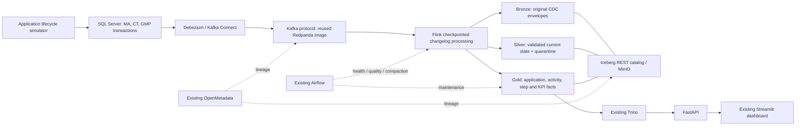

# NDA application streaming migration

This is an implementation candidate, not an activated or production-certified
pipeline. The existing Streamlit dashboard remains on reference data by default.
No existing containers, images, volumes, or service configurations were replaced.

## Architecture



Bronze → silver → gold expresses data quality and business modeling. Flink is the
processing engine. It can continuously implement those layers, avoiding scheduled
ETL batches. It does not replace the medallion architecture. The candidate uses
one Flink StatementSet with a shared normalized changelog and separate persisted
bronze/silver/gold branches. It does **not** append-tail mutable Iceberg tables,
which would miss or mishandle CDC updates and deletes.

Kafka carries genuine Debezium events produced from committed SQL Server writes.
The simulator does not publish fabricated Debezium envelopes or precomputed KPI
totals. Redpanda provides the Kafka protocol using an already cached image; it is
not an Apache Kafka broker distribution. Replace the endpoint with existing Kafka
if that distribution is required.

## Reference analysis

`reference-audit.json` records 231 consistency findings in the supplied fixture.
The eight top-level sections contain 43 KPI series across MA, CT, GMP. Examples
include negative volumes, numerator greater than denominator, and displayed
percentages disagreeing with their own counts. Duration sample sizes use
`sample_n`, not numerator/denominator.

The file cannot uniquely reconstruct historical applications. It supplies the
dashboard contract, targets, baselines, workflow names, approximate durations and
simulation performance probabilities. Synthetic records are newly generated,
explicitly labelled, and not claimed to reproduce the inconsistent source totals.
The first simulator uses equal configurable application counts per process rather
than treating inconsistent volume totals as authoritative arrival rates.

## Grain and business rules

| Fact | Exact grain / key | Business identity |
|---|---|---|
| `fact_ma_applications` | One MA application / `record_id` | Product identity in `entity_id`; renewal and variation are separate applications |
| `fact_ct_applications` | One CT submission / `record_id` | Trial identity in `entity_id`; amendment is a separate submission |
| `fact_gmp_applications` | One GMP application / `record_id` | Facility identity in `entity_id`; inspection/assessment is a child activity |
| `fact_<process>_activities` | One activity instance / `record_id` | Parent application; evaluation, response, inspection, CAPA, report or decision |
| `fact_<process>_steps` | One workflow step instance / `record_id` | Parent application; repeated cycles must receive new IDs |
| `fact_<process>_kpi_measurements` | One eligible activity × KPI definition | `measurement_id = activity_id:kpi_id`; parent and activity IDs retained |

The SQL transaction tables are accumulating snapshots: RECEIVED → IN_REVIEW →
COMPLETED. Inserts and updates are committed one at a time at configurable wall
clock intervals. UUIDs are stable for seed, simulation start, process and index;
replay ignores already applied revisions. The simulator clock is accelerated and
separate from the real ingestion clock. The initial default starts 2025-04-01.

`contracts.py` maps every KPI explicitly to an activity, optional submission type,
route, aggregation and success criterion. Regulatory SLA days are **simulation
assumptions pending business approval**, not inferred laws. Percentages use
completed eligible activities as denominator and completion by due date as
numerator; compliance uses assessment outcome. Reporting quarter is completion
quarter. Missing observations are absent, never zero or failures. Duration medians
are computed from individual measurements, never averages of quarterly medians.

Facility/site compliance is currently inspection-assessment grain: repeated
assessments count separately. Confirm whether the business instead requires one
latest assessment per facility per quarter before a production cutover. The
`continental` MA duration label also needs an agreed geographical eligibility
rule; the initial candidate includes all MA decisions. The reference supplies no
authoritative country dimension. Entity IDs are synthetic degenerate dimensions,
not production master-data/SCD2 entities.

Capacity, staffing, historic WIP, query-cycle rework and external-review facts are
not yet modeled. Their unavailable measures are not synthesized by the live API.
The dashboard's legacy random drill-down/bottleneck fallbacks are disabled in live
mode. Reference mode remains compatible with the existing demonstration.

## Partitioning and recovery

| Layer | Candidate partition | Reason |
|---|---|---|
| Bronze | Kafka publish day | Bounded operational replay scans; original envelope, partition and offset retained |
| Silver current state | Immutable original application `cohort_month` | Upsert/delete locality; never partition on mutable status or update timestamp |
| Gold application/activity/step facts | Same application cohort month | Avoid moving an application on each state transition |
| Gold KPI measurement facts | Same application cohort month | Corrections can change reporting quarter without changing equality partition |

All mutable Iceberg tables use format v2 and equality keys including the partition
source (`record_id, cohort_month` or `measurement_id, cohort_month`). Flink CDC
duplicate normalization is enabled. No state TTL is set that could silently discard
old corrections. Bronze can still contain genuine duplicate source deliveries;
silver/gold current-state keys handle those. A malformed Debezium record fails the
job rather than being silently skipped; Kafka retention preserves it for repair.
Domain-invalid decoded records route to quarantine.

For real scale, measure bytes per partition and file counts before increasing
granularity. Add identity-derived `bucket(16, record_id)` only when monthly
partitions/writer parallelism justify it; include the source key in equality fields.
Avoid partitioning by individual application, facility, status, or KPI ID. Local
target files are 256 MiB with Zstandard. Production target range is 256–512 MiB,
tuned to volume and Trino scans. Sixty-second commits will create small files at
demo volume; the operations DAG compacts only NDA gold tables. Extend maintenance
to bronze/silver after measuring their growth.

Kafka has three partitions per source table locally; entity keys preserve per-row
order. Local replication factor 1 is **not production HA**. Production needs a
replicated Kafka cluster (normally replication factor 3 / min ISR 2), TLS/SASL,
durable shared Flink checkpoints and HA JobManager recovery, SQL Server backups
and CDC retention exceeding maximum outage plus replay time. Seven-day Kafka and
CDC retention is the starting setting, not a guaranteed outage budget. Preserve
Connect offsets, schema-history topics, checkpoint state and Iceberg metadata.

The local Flink checkpoint volume is shared by the two local containers; it is
not multi-host storage. Production must use durable object-store checkpoints with
the matching Flink filesystem plugin. Restart a failed job from its checkpoint or
savepoint; do not submit a fresh job from earliest offsets against existing bronze
and call that exactly-once recovery. Iceberg commits are per table, not atomic
across all medallion branches. Serving reports eventual consistency accordingly.

## Reuse and memory

Discovered shared project:
`deng-workflows/projects/spark-iceberg-airflow-postgres`, network
`atc-poc_pipeline_net`.

Reuse the running MinIO, REST catalog, Airflow and OpenMetadata containers. Reuse
the existing stopped Trino container after addressing its memory requirement.
Docker confirmed its last exit was `OOMKilled=true`, exit 137. Use the cached
Redpanda image for the missing Kafka-compatible broker. SQL Server, Debezium and
Flink images were absent. The two Flink services share one image and the same
downloaded connector jars; no custom builds are needed. Simulator and FastAPI run
as local Python processes, not additional images.

Docker currently has about 15.5 GiB and the existing services use about 11 GiB.
The candidate services add roughly 8–10 GiB of configured limits, plus Trino.
Do not start the whole candidate stack into that headroom. Decide which existing
workloads can be paused, increase available memory if the host supports it, or
provide external SQL Server/Flink/Kafka endpoints. No protected ATC service was
stopped to make room.

## Reproducible checks (no infrastructure mutation)

From the dashboard repository:

```powershell
python -m streaming.profile_reference
python -m streaming.generate
python -m streaming.simulator --count 30 --dry-run
python -m pytest streaming/tests -q
docker compose --env-file streaming/.env.example -f streaming/compose.yaml config --quiet
```

Generated SQL and connector settings live under gitignored `streaming/generated`;
generators are version-controlled. Credentials are deliberately not in source.

## Activation sequence — executed end to end on 2026-09-13

1. Allocate enough memory or designate external services. Record current shared
   container/image IDs. Create only `NDAStreaming` and `nda_*` lakehouse namespaces.
2. Create an NDA-scoped MinIO service account for NDA warehouse/checkpoint prefixes;
   do not copy root credentials into source. Copy `.env.example` to `.env`, fill
   values, and load them into the Python process environment. Compose's `--env-file`
   does not automatically export variables to the host Python process.
3. Download connector jars with `python -m streaming.prepare_jars`. It verifies
   published Maven checksums (SHA-512, or SHA-1 for older Flink artifacts) and
   reuses cached files. Pull only missing official image tags. The shaded Hadoop
   uber jar is required: Iceberg's Flink runtime resolves
   `org.apache.hadoop.conf.Configuration` even for a REST catalog on S3FileIO.
4. Use targeted `docker compose --env-file streaming/.env -f streaming/compose.yaml
   up -d --no-recreate kafka sqlserver connect jobmanager taskmanager` only after
   capacity is resolved. SQL Server Developer is for nonproduction use only.
5. Run `python -m streaming.bootstrap source` against the new database, or review
   and apply generated `01-source.sql` with sqlcmd. The bootstrap creates
   separate `nda_simulator` and `nda_debezium` SQL logins from secrets. Simulator
   needs SELECT/INSERT/UPDATE only on NDA application tables. Debezium needs
   table SELECT, CDC reader role membership and documented snapshot/CDC
   permissions. Never run the application with `sa`. Validate SQL Server Agent
   and both database/table CDC before connector registration.
6. Create single-partition compacted Connect config/schema-history topics and
   compacted offsets/status topics with retention appropriate to recovery. POST
   the generated Debezium configuration to `CONNECT_URL` (port 8093 here; the
   existing Trino owns 8083) using `python -m streaming.bootstrap connector`.
   Debezium needs `SELECT` on the whole `cdc` schema, not only the gated `_CT`
   tables, to read `captured_columns`/`change_tables` when building schemas. Verify connector/task state
   RUNNING and the snapshot completion before the simulator.
7. Submit generated `03-medallion.sql` with the existing Flink SQL client in the
   candidate JobManager. Check planner compatibility, running state and the first
   successful checkpoint. The `flink-state` volume must be owned by the `flink`
   user (uid 9999): the image drops privileges from root, so a root-owned volume
   fails checkpointing with "Failed to create directory for shared state".
8. Restore the existing Trino service with an agreed memory allocation, verify
   it is actually attached to the shared network (an OOM-killed container can
   restart with `NetworkMode` set but no endpoint, so REST catalog calls fail
   DNS) and that its S3 credentials match the ones in `.env`, verify
   its REST catalog, and apply `04-gold-views.sql` using `python -m
   streaming.bootstrap gold`. Grant the dashboard user read
   access only to NDA gold. In local Trino, a username alone is not authorization;
   production requires authentication and catalog access-control rules.
9. Start a bounded simulation, for example `python -m streaming.simulator --count
   30 --interval 0.25`. Pass `--as-of` to stop the simulation clock so unfinished
   work stays open at RECEIVED/IN_REVIEW instead of draining to a fully
   completed history. Verify committed source counts → Kafka CDC → Iceberg
   snapshots → Trino KPI counts. Exercise one correction, replay and delete.
10. Start the API with `python -m uvicorn streaming.api:app --host 127.0.0.1 --port
    8095`. Set the same `NDA_API_KEY` in Streamlit's process environment. Verify
    authenticated `/health/ready` and `/v1/dashboard`, then select **Live application
    stream** in the dashboard's Data source expander.
11. Ingest SQL Server, Kafka and Trino metadata into existing OpenMetadata services
    named `nda_sqlserver`, `nda_kafka`, `nda_trino`. Preview `python -m
    streaming.lineage`, then use `--publish`. Missing catalog entities fail loudly.
    Add the Flink ingestion connector and runtime job/snapshot evidence before
    calling this executed lineage. The manifest alone is only design lineage.
12. Add the operations DAG to the existing Airflow DAG mount, configure its three
    connections, validate parsing, then unpause only that DAG. Airflow monitors
    checkpoints/data quality and compacts; it does not repeatedly schedule the
    long-running Flink job.

The initial API has a guarded 50,000-row-per-fact-table cohort adapter for the
legacy volume/step contract. KPI aggregation runs in Trino over gold measurement
tables. Move all legacy volume/step aggregation into SQL marts before serving
large production cohorts. Exact median aggregation retains the group's values;
benchmark cardinality or agree a labelled approximation before scaling it.

## Acceptance still required before live / production claims

- Run SQL Server migrations, connector validation and Flink planner against the
  selected actual versions; no database/container integration was claimed by unit tests.
- Check parent identity/grain and approve each KPI's SLA, denominator, geography,
  route, completion-quarter and repeat-inspection rules with the data owner.
- Reconcile latest source revisions with silver/gold counts; restart from a
  checkpoint, replay CDC, apply late correction and delete, and verify no duplicate
  KPI contributions. Test quarantine and malformed-event recovery.
- Capture actual checkpoint IDs, Kafka offsets/LSNs, Iceberg snapshot IDs, API
  output and OpenMetadata edges for the same run.
- Add master dimensions/SCD policy, unimplemented capacity/WIP/rework facts,
  durable HA state, least privilege, secrets/TLS, monitoring alerts, capacity
  load tests, schema evolution and recovery/retention exercises.

## Primary references

- [Debezium SQL Server CDC and recovery](https://debezium.io/documentation/reference/stable/connectors/sqlserver.html)
- [Flink 1.20 Debezium changelog format and duplicate normalization](https://nightlies.apache.org/flink/flink-docs-release-1.20/docs/connectors/table/formats/debezium/)
- [Iceberg Flink upsert equality/partition requirements](https://iceberg.apache.org/docs/latest/flink-writes/)
- [OpenMetadata lineage API](https://docs.open-metadata.org/v1.12.x/api-reference/lineage/add)
